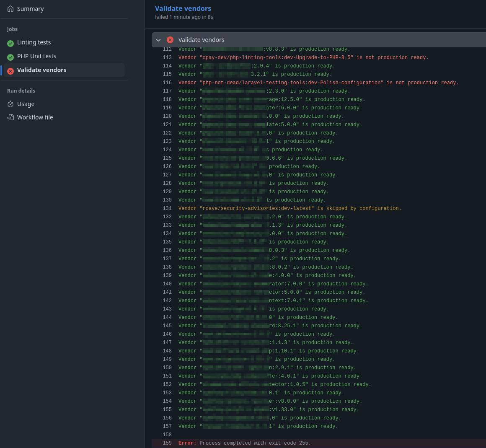

Elephant Studio :: Laravel testing tools
============

This package provides preconfigured `PHP Unit` and `Linting Tools` packages for Laravel projects.

It also includes vendor testing tool that can be run during GitHub workflow to disable PR merging if some vendors do not meet production requirements.

### PHP Unit configuration contains

1. Test Cases
    - [Controller Test Case](src/Test/TestCase/ControllerTestCase.php) - for Http requests testing
    - [Feature Test Case](src/Test/TestCase/FeatureTestCase.php) - for PHP features testing
    - [Unit Test Case](src/Test/TestCase/UnitTestCase.php) - for Unit testing
2. [Configuration file](src/Config/phpunit.xml)
    - Works with default tests directories _(these must be created)_:
      - `tests/Controller`
      - `tests/Feature`
      - `tests/Unit`
    - Also works with Laravel Modules _(not mandatory)_:
      - `Module/*/Test/Controller`
      - `Module/*/*/Test/Controller`
      - `Module/*/Test/Feature`
      - `Module/*/*/Test/Feature`
      - `Module/*/Test/Unit`
      - `Module/*/*/Test/Unit`
3. [vendor/elph-studio/laravel-testing-tools/src/Config/phpunit.xml](src/Config/phpunit.xml) will be used only if there is no local configuration file `config/phpunit.xml`

### Linting tools configuration contains

1. Strict [PHP CS](https://github.com/squizlabs/PHP_CodeSniffer) [rules set](src/Config/phpcs_rules.xml)
    - [Slevoman Coding Standards](https://github.com/slevomat/coding-standard) - included
    - [Squizlabs PHP CodeSniffer Standards](https://github.com/squizlabs/PHP_CodeSniffer) - included
    - [OPAY Coding Stardards](https://github.com/opay/lib.php-linting-tools) - included
    - [Moxio PHP CodeSniffer Standards](https://github.com/Moxio/php-codesniffer-sniffs) - removed due to low maintainability and recurring conflicts with upper mentioned libraries latest versions
2. [PHP CS Fixer](https://github.com/PHP-CS-Fixer/PHP-CS-Fixer) [rules set](src/Config/csfixer.php)
3. These rules sets will be used only if local rules set are not found in `config/phpcs_rules.xml` and `config/csfixer.php`

### Installation & running

Install
> $ composer require --dev elph-studio/laravel-testing-tools

Run PHP Unit tests:
> $ vendor/bin/unit

Run Linting tools _(run both PHP CS and PHP CS Fixer)_:

> $ vendor/bin/lint

Automatic Lint fixing:

> $ vendor/bin/lint fix

### Running Vendors Validator in GitHub Workflow

.env
```dotenv
VENDORS_VALIDATOR_URL=https://raw.githubusercontent.com/elph-studio/laravel-testing-tools/refs/heads/main/src/Helper/vendors_validator.php
VENDORS_VALIDATOR_SKIP=roave/security-advisories
```

workflow.yml
```yaml
  vendors:
     name: Validate vendors
     runs-on: ubuntu-latest
     steps:
        - name: Checkout required files
          uses: actions/checkout@v4
          with:
             sparse-checkout: |
                .github/.env
                composer.lock
             sparse-checkout-cone-mode: false

        - name: Read .env file
          uses: xom9ikk/dotenv@v2.3.0
          with:
             path: .github/

        - name: Download vendors_validator
          run: |
             curl -sSL ${{ env.VENDORS_VALIDATOR_URL }} \
               -o vendors_validator.php

        - name: Validate vendors
          run: php vendors_validator.php --skip=${{ env.VENDORS_VALIDATOR_SKIP }}
```

Failed workflow example:

<a href="readme/images/vendors_validator_workflow.jpg"></a>
